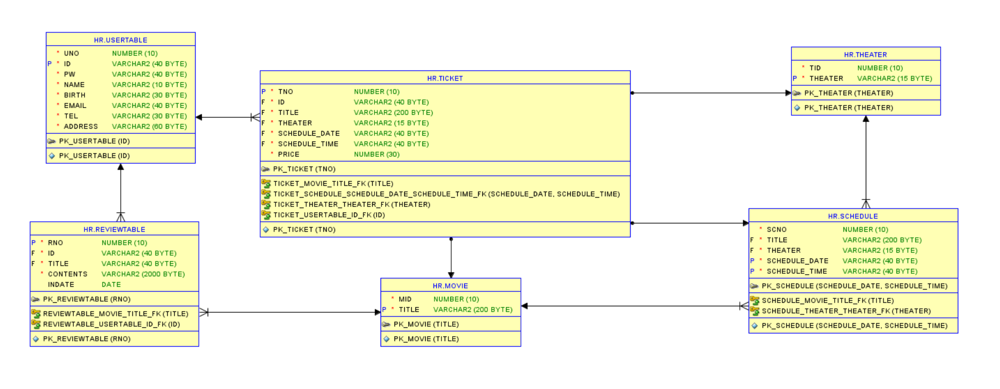

## :pushpin: Mubi
>영화 예매 사이트

 

### 1.제작기간&참여 인원
* 2022.11.29. ~ 2022.12.27.   
* 팀프로젝트(3인)

 

### 2.사용기술
* JAVA11   
* ORACLE   
* JAVASCRIPT   
* AJAX

 

### 3.ERD

 

### 4.핵심기능
>Admin ( 개봉 영화 목록 관리, 상영관 목록 관리, 영화 상영 시간표 관리 )   
- 개봉 영화를 조회, 등록할 수 있다.   
- 상영관 목록을 조회, 등록할 수 있다.   
- 영화 상영 시간표를 조회, 등록할 수 있다.      
>Client ( 회원가입, 로그인, 회원정보 수정 / 탈퇴, 예매, 예매 확인, 영화 리뷰 댓글 작성 )   
1. 비회원   
- 영화 정보 및 리뷰를 조회할 수 있다.   
2. 회원   
- 영화 정보 및 리뷰를 조회할 수 있다.   
- 리뷰 댓글을 작성 / 수정 / 삭제 할 수 있다.   
- 예매 및 예매 확인을 할 수 있다.   
- 회원 정보를 수정하고 탈퇴할 수 있다.   

 

### 5.핵심 트러블 슈팅 

### 6. 느낀점

