## :pushpin: Mubi
>영화 예매 사이트

 

### 1. 제작기간&참여 인원
* 2022.11.29. ~ 2022.12.27.   
* 팀프로젝트(3인)

 

### 2. 사용기술
* JAVA11   
* ORACLE   
* JAVASCRIPT   
* AJAX

 

### 3. ERD
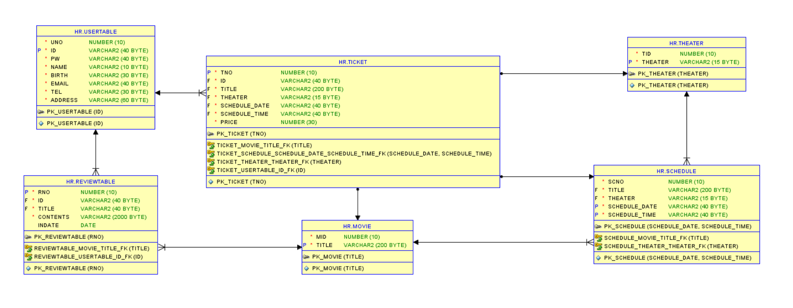

 

### 4. 핵심기능
>Admin ( 개봉 영화 목록 관리, 상영관 목록 관리, 영화 상영 시간표 관리 )   
- 개봉 영화를 조회, 등록할 수 있다.   
- 상영관 목록을 조회, 등록할 수 있다.   
- 영화 상영 시간표를 조회, 등록할 수 있다.      
>Client ( 회원가입, 로그인, 회원정보 수정 / 탈퇴, 예매, 예매 확인, 영화 리뷰 댓글 작성 )   
1. 비회원   
    - 영화 정보 및 리뷰를 조회할 수 있다.   
2. 회원   
    - 영화 정보 및 리뷰를 조회할 수 있다.   
    - 리뷰 댓글을 작성 / 수정 / 삭제 할 수 있다.   
    - 지도를 보고 영화관을 확인하고, 예매 및 예매 확인을 할 수 있다.   
    - 회원 정보를 수정하거나 탈퇴할 수 있다.   

 

상세설명 펼치기

 

#### 4-1. 전체흐름

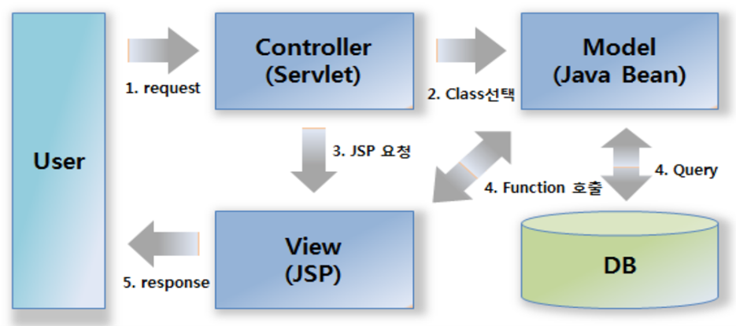
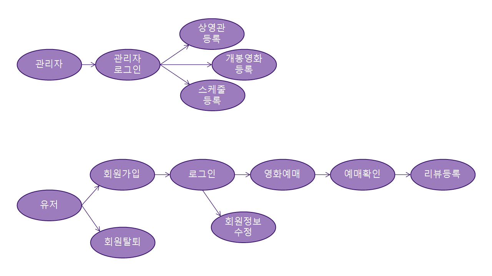
 
 

#### 4-2. Connection ✔️ [코드확인](https://github.com/jin4618/Mubi/blob/1195f0d80e1d486736aeea554c1004a6a93a2359/src/dbconn/DBConn.java)
-	JDBC를 활용한 OracleDB 연결

 

#### 4-3. 관리자 페이지
##### ‘usertable’에 저장된 관리자 계정과 비교하여 로그인 ✔️ [코드확인](https://github.com/jin4618/Mubi/blob/6f466c29b4a08575fd83d17868638eb34816e1d0/src/user/userDAO.java#L38-L41)
<!-- ✔️ [Command 코드확인](https://github.com/jin4618/Mubi/blob/6f466c29b4a08575fd83d17868638eb34816e1d0/src/com/Mubi/impl/user/userLogin.java#L38-L43) -->

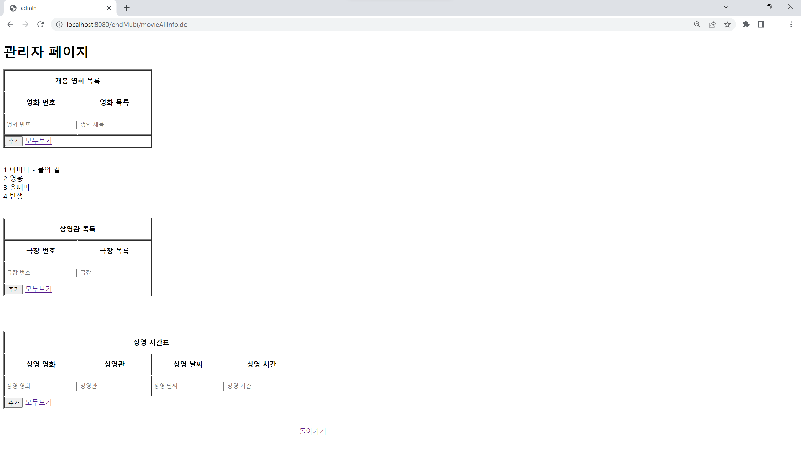
 

✔️ [코드확인](https://github.com/jin4618/Mubi/blob/6f466c29b4a08575fd83d17868638eb34816e1d0/src/screen/screenDAO.java)
-	상영관 등록 / 조회 => Controller를 거쳐 ‘theater’ 테이블에 INSERT
-	개봉 영화 등록 / 조회 => Controller를 거쳐 ‘movie’ 테이블에 INSERT
-	상영시간표 등록 / 조회 => Controller를 거쳐 ‘schedule’ 테이블에 INSERT

 

#### 4-4. 메인 화면

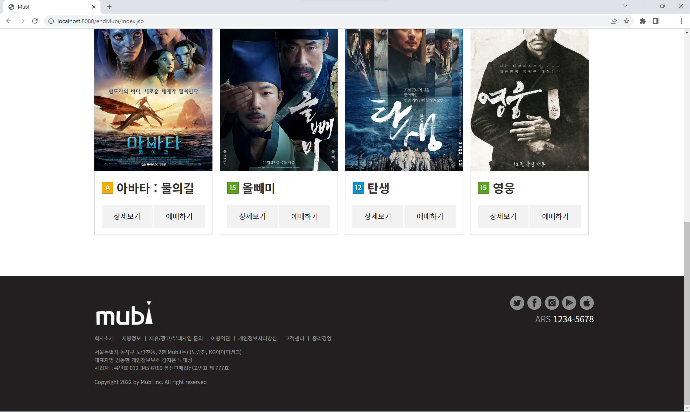
 

-	로그인 / 회원가입
-	영화 정보 swiper ✔️ [코드확인](https://github.com/jin4618/Mubi/blob/6f466c29b4a08575fd83d17868638eb34816e1d0/WebApp/index.jsp#L320-L338)
-	영화 예매하기
-	영화 상세보기
-	내 정보 수정
-	회원 탈퇴

 

#### 4-5. 회원가입

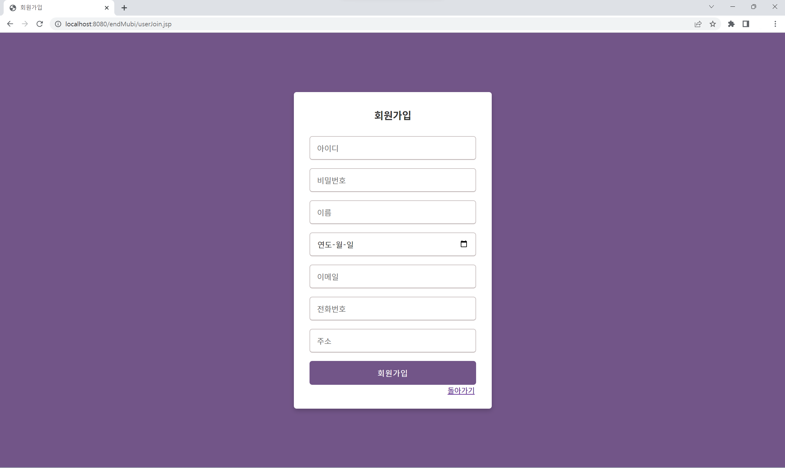
 

-	아이디, 비밀번호, 이름, 생년월일, 이메일, 전화번호, 주소를 입력 => Controller를 거쳐 DB에서 ‘usertable’ 테이블에 회원정보를 INSERT

 

#### 4-6. 로그인 ✔️ [Controller](https://github.com/jin4618/Mubi/blob/9f51c274d68212a8a29bb91d95cc2b44e7da4a37/src/com/Mubi/controller/Controller.java#L113-L123) ✔️ [Command](https://github.com/jin4618/Mubi/blob/9f51c274d68212a8a29bb91d95cc2b44e7da4a37/src/com/Mubi/impl/user/userLogin.java) ✔️ [View](https://github.com/jin4618/Mubi/blob/9f51c274d68212a8a29bb91d95cc2b44e7da4a37/WebApp/index.jsp#L80-L86)

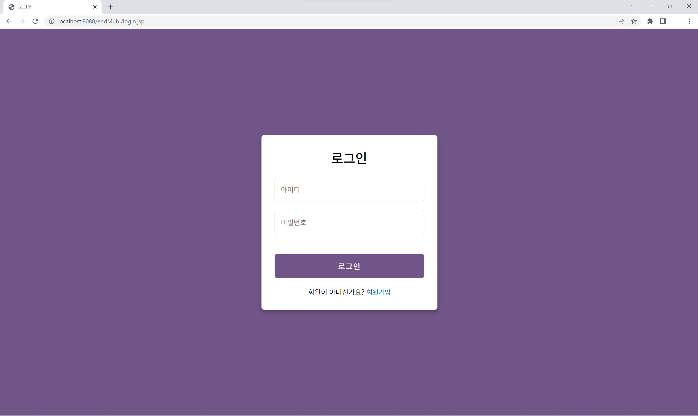

##### 로그인 후 Main

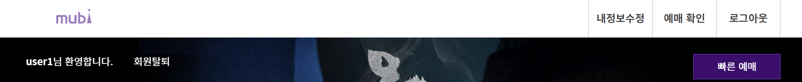
 

-	아이디와 비밀번호 입력 => Controller를 거쳐 DB에 ‘usertable’ 테이블에서 회원정보와 비교하여 일치할 경우 로그인

 

#### 4-7. 회원정보 수정

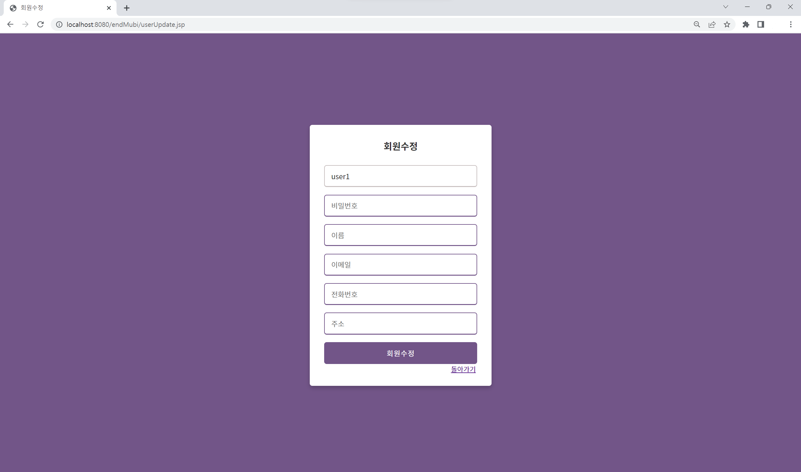
 

- 아이디와 생년월일을 제외한 비밀번호, 이름, 이메일, 전화번호, 주소를 입력
    - 아이디는 Session으로 받아 출력하고 함께 Controller를 거쳐 DB에서 아이디로 조건을 주어 ‘usertable’ 테이블에 회원정보를 UPDATE

 

#### 4-8. 회원탈퇴 ✔️ [코드확인](https://github.com/jin4618/Mubi/blob/9f51c274d68212a8a29bb91d95cc2b44e7da4a37/src/user/userDAO.java#L93-L133)

- 아이디와 비밀번를 입력
    - Controller를 거쳐 DB에 ‘usertable’ 테이블에서 아이디가 기본키이며, ‘ticket’ 테이블과 ‘reviewtable’ 테이블에서는 외래키로 사용되기 때문에 각 테이블에서 데이터를 조회하여 DELETE

 

#### 4-9. 영화 상세보기 및 리뷰

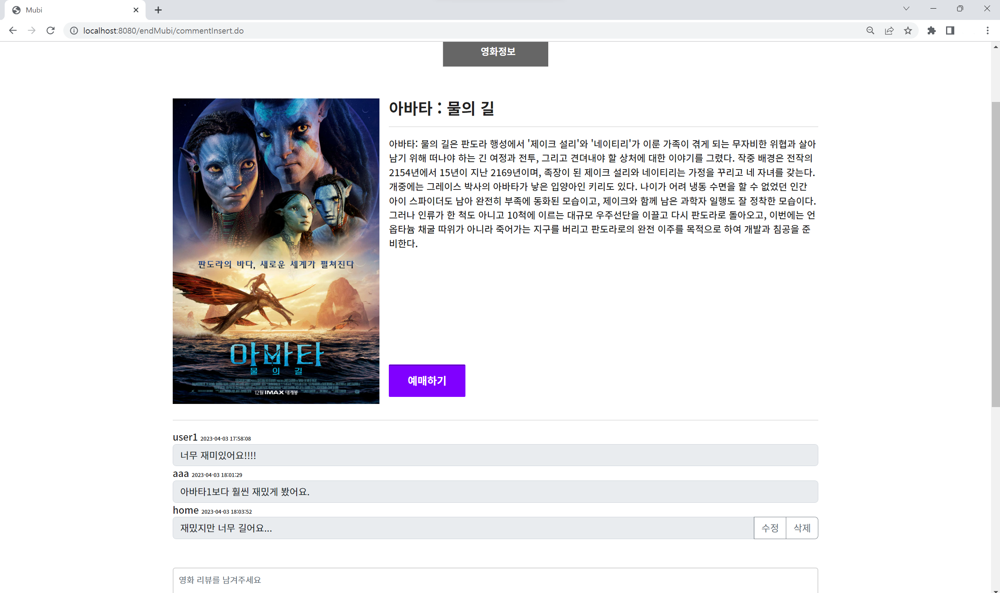
 

-	메인 화면에서 영화 상세 보기를 누를 시 해당 영화에 맞는 영화 상세 설명과 리뷰 목록을 출력한다.
    - View에서 상세보기 누를 때 a 링크에 영화 제목을 같이 가져가 Controller를 거쳐 Command에서 equals로 조건을 주어 Controller 경로를 지정해준다. ✔️ [코드확인](https://github.com/jin4618/Mubi/blob/9f51c274d68212a8a29bb91d95cc2b44e7da4a37/src/com/comment/my/Allcomment.java)
-	댓글 등록 시 아이디 세션을 함께 Controller로 보내어 ‘reviewtable’ 테이블에 댓글 내용과 아이디를 저장한다.
-	댓글 수정 시 시퀀스 키인 댓글 고유 번호를 조건으로 걸어 그에 맞는 영화 정보 페이지에서 수정 댓글을 작성하여 UPDATE  ✔️ [코드확인]()

 

#### 4-10. 영화 예매

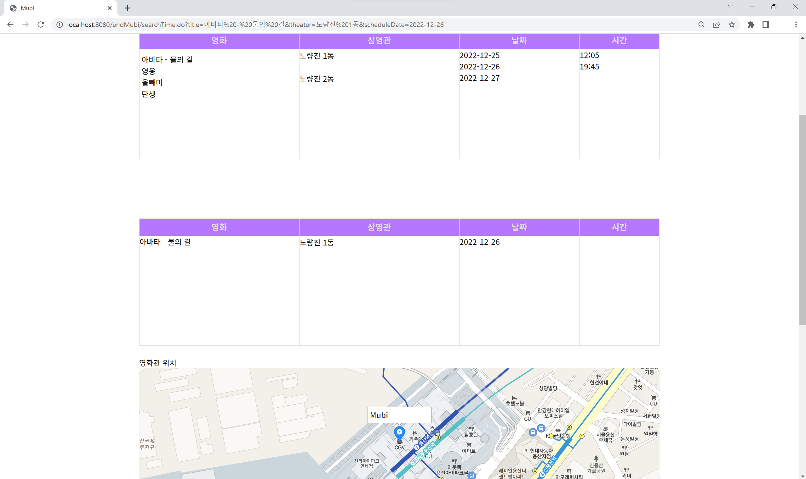
 

-	지도 API를 이용하여 영화관 위치를 확인한다.
-	보고 싶은 영화, 상영관, 날짜, 시간을 선택한 후 예매하기를 진행한다. => Controller를 거쳐 DB에서 ‘ticket’ 테이블에 가격과 함께 저장
 

- 결제화면

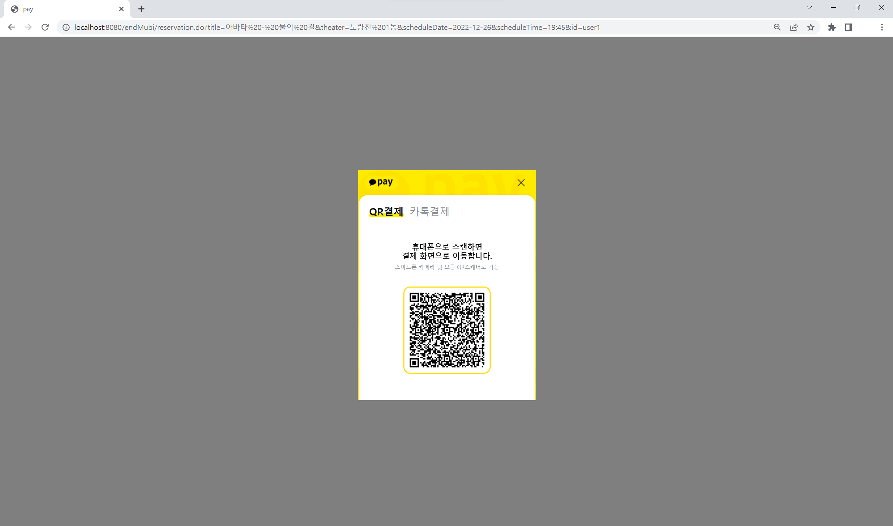
 

-	카카오페이 결제 API를 이용하여 결제 진행 => QR코드 oR 카톡결제(핸드폰 번호, 생년월일 입력) 두 방식으로 결제 가능 ✔️ [코드확인](https://github.com/jin4618/Mubi/blob/9f51c274d68212a8a29bb91d95cc2b44e7da4a37/WebApp/kakaopay.jsp#L33-L89)

 

#### 4-11. 예매 확인

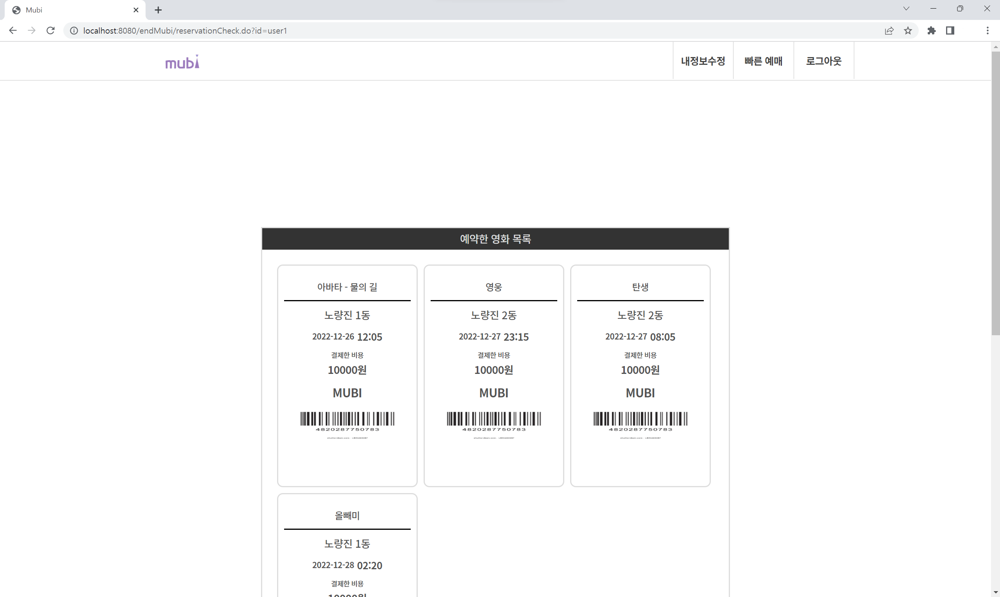
 

-	Controller를 거쳐 유저 아이디에 맞는 예매 내역을 출력한다. => ‘ticket’ 테이블 조회

 

### 5. 핵심 트러블 슈팅

#### 5-1. 예매할 때 선택한 것만 뜨는 것이 아닌 선택해도 모든 목록이 보여 헷갈리는 문제
상영시간표 테이블 밑에 결과 테이블을 하나 더 생성하여 선택할 때마다 Attribute로 가져와 조건으로 걸 영화, 상영관, 날짜, 시간 순으로 유저가 선택한 것들만 출력되도록 해결

기존 코드

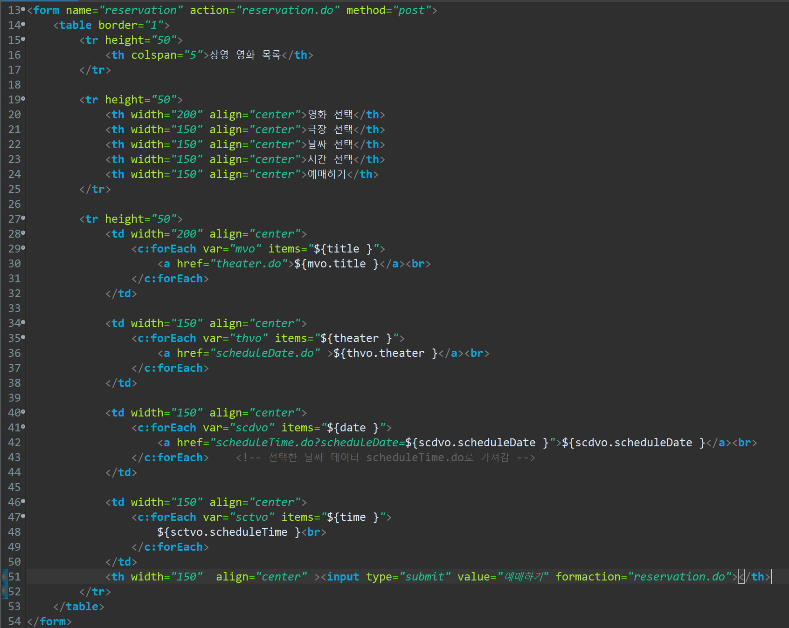

개선된 코드

https://github.com/jin4618/Mubi/blob/d6b148ec3210f3c00e186182742a1a001a69481f/WebApp/reservation.jsp#L96-L179

 

#### 5-2. 결제 후 페이지 이동
결제 후 페이지가 이동하지 않고 빈 화면으로 뜨는 문제

기존 코드

    
    if ( rsp.success ) {
	    	jQuery.ajax({
	    	url: "<%=request.getContextPath()%>index.jsp",
	    	type :'POST',
	    	dataType: 'json',
		data: {
    		"id": "<%=id%>",
    		"title" : "${orititle }",
    		"theater" : "${oritheater }",
    		"scheduleDate" : "${oridate }",
    		"scheduleTime" : "${oritime }",
    		"price" : "10000"
    
    		} 
	    	}).done(function(data) {
	    		location.href="index.jsp";
	    	});
    } else {
        var msg = '결제에 실패하였습니다.';
        msg += '에러내용 : ' + rsp.error_msg;
    	alert(msg);
        location.href="rscreen.do";
    }

개선된 코드

https://github.com/jin4618/Mubi/blob/d6b148ec3210f3c00e186182742a1a001a69481f/WebApp/kakaopay.jsp#L51-L85

 

#### 5-3. 리뷰 수정 시 수정하는 페이지로 넘어갈 때 각 영화마다 페이지를 만들어 페이지가 많아지는 문제

개선된 코드

    
- JSTL을 활용하여 영화 title로 조건을 주고 그에 맞게 내용이 출력되도록 한 페이지로 해결
https://github.com/jin4618/Mubi/blob/d6b148ec3210f3c00e186182742a1a001a69481f/WebApp/commentSearchOne.jsp#L98-L203

 

### 6. 느낀점

이번 프로젝트를 진행하면서 초반 의견 조율이 되지 않아 진행 상황이 좋지 않았습니다. 생각보다 많은 문제들을 마주하고 다른 조들에 비해 진도가 매우 낮아 부족함도 많이 느끼고, 아쉬움이 많이 남았던 프로젝트였습니다. 그래도 짧은 시간 내에 하나하나씩 해결해 나가면서 실력적인 면에서는 많은 성장을 할 수 있었습니다. 그래서 프로젝트 발표 기간이 끝난 후에도 부족했던 리뷰게시판과 결제 기능 부분을 보완하여 전보다 좀 더 완성도를 높였습니다. 만약 앞으로도 시간이 된다면 좌석기능과 리뷰 게시판은 별점으로 평점을 내는 기능까지 한 번 시도해보고 싶습니다. 이번을 계기로 초반에 팀원들과의 소통이 매우 중요하다는 걸 깨달았습니다. 앞으로는 충분한 소통으로 서로 맞춰가며 설계하고 개발하여 시간적 여유를 가지고 완성도 높은 프로젝트를 만들자를 다짐하게된 계기였습니다.

