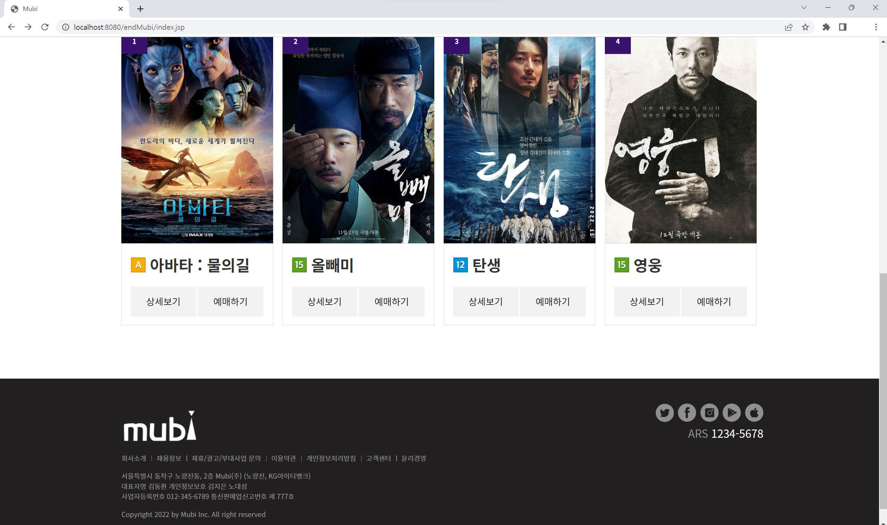

## :pushpin: Mubi
>영화 예매 사이트

 

### 1.제작기간&참여 인원
* 2022.11.29. ~ 2022.12.27.   
* 팀프로젝트(3인)

 

### 2.사용기술
* JAVA11   
* ORACLE   
* JAVASCRIPT   
* AJAX

 

### 3.ERD

 

### 4.핵심기능
>Admin ( 개봉 영화 목록 관리, 상영관 목록 관리, 영화 상영 시간표 관리 )   
- 개봉 영화를 조회, 등록할 수 있다.   
- 상영관 목록을 조회, 등록할 수 있다.   
- 영화 상영 시간표를 조회, 등록할 수 있다.      
>Client ( 회원가입, 로그인, 회원정보 수정 / 탈퇴, 예매, 예매 확인, 영화 리뷰 댓글 작성 )   
1. 비회원   
- 영화 정보 및 리뷰를 조회할 수 있다.   
2. 회원   
- 영화 정보 및 리뷰를 조회할 수 있다.   
- 리뷰 댓글을 작성 / 수정 / 삭제 할 수 있다.   
- 예매 및 예매 확인을 할 수 있다.   
- 회원 정보를 수정하거나 탈퇴할 수 있다.   

 

상세설명 펼치기

 

#### 4-1. 전체흐름

 
 

#### 4-2. Connection ✔️ [코드확인]()
-	JDBC를 활용한 OracleDB 연결

 

#### 4-3. 메인 화면

 

 

#### 4-4. 회원가입 및 탈퇴 ✔️ [코드확인](https://github.com/jin4618/cafesmartorder/blob/77eb38e12f8fdd77cdf12e8586e39f07396a9116/src/member/MemberDAO.java#L20-L52)

 

- 가입 번호(핸드폰 번호 뒤 4자리) 입력 => DB에서 'member1' 테이블에 insert
- 회원 번호(핸드폰 번호 뒤 4자리) 입력 => DB에서 'member1' 테이블에서 데이터를 조회하여 delete
 

#### 4-5. 로그인

 
<!--
-	수량 입력
-	메뉴 추가할 때마다 추가한 메뉴, 수량 및 가격 출력 => DB에서 ‘CafeTable’ 테이블에 저장 ✔️ [코드확인](https://github.com/jin4618/cafesmartorder/blob/671901a5c604aab8d1ec731f939ebe9a8a34c87f/src/order/OrderDAO.java#L130-L196)  
 

#### 4-6. 포인트 적립 및 결제

 

- 총 주문 내역 출력 -> DB에 ‘CafeTable’ 테이블에서 데이터를 조회하여 불러옴 ✔️ [코드확인](https://github.com/jin4618/cafesmartorder/blob/671901a5c604aab8d1ec731f939ebe9a8a34c87f/src/menu/Count.java#L78-L94)  
-	Yes 버튼 누를 시 포인트 적립 창으로 이동 
- 포인트 적립을 원할 경우 회원 번호를 입력 받아 적립 
=> DB에 'member1' 테이블에서 데이터를 조회하고 회원번호가 맞는지 확인 ✔️ [코드확인](https://github.com/jin4618/cafesmartorder/blob/671901a5c604aab8d1ec731f939ebe9a8a34c87f/src/point/PointDAO.java#L56-L77)  
=> 현재 포인트 내역 출력 / 5개 모일 시 아메리카노 쿠폰 증정 (포인트 초기화) ✔️ [코드확인](https://github.com/jin4618/cafesmartorder/blob/671901a5c604aab8d1ec731f939ebe9a8a34c87f/src/point/Point_1.java#L52-L91) ✔️ [코드확인](https://github.com/jin4618/cafesmartorder/blob/671901a5c604aab8d1ec731f939ebe9a8a34c87f/src/point/PointDAO.java#L81-L121) 
- 적립을 원하지 않을 경우 결제만 진행 
 

#### 4-7. 유효성 검사 ✔️ [수량 코드확인](https://github.com/jin4618/cafesmartorder/blob/671901a5c604aab8d1ec731f939ebe9a8a34c87f/src/menu/Menu.java#L273-L292) ✔️ [회원번호 코드확인](https://github.com/jin4618/cafesmartorder/blob/671901a5c604aab8d1ec731f939ebe9a8a34c87f/src/menu/Menu.java#L577-L596)

 

- 입력 받아야 하는 Data 조건이 맞지 않을 경우 다시 입력 받음
 

-->

 

### 5.핵심 트러블 슈팅 

### 6. 느낀점

